# Customer Feedback Intelligence and PM Decision-Support System

## 1. Project Overview

Product teams often receive large volumes of customer reviews, but raw reviews are difficult to prioritise and act on.

This project converts raw customer feedback into a ranked set of product issues with counts, severity, trends, customer evidence, and recommended PM actions.

The system is designed as a fixed pipeline rather than an autonomous agent.

---
## Product Persona

Primary user: Product Manager / Product Operations Manager

The user needs to review large volumes of customer feedback and decide:

- which issues require immediate attention;
- which problems are increasing;
- which feature requests may deserve roadmap validation;
- what customer evidence supports each issue;
- what the product team should investigate next.

## Input

The system takes raw customer reviews as input.

Each review may contain:

- review text
- date
- app identifier
- rating metadata

The system does not rely on a manually predefined keyword list for every possible product issue.

## Output

The final PM-facing output contains:

- ranked product issue
- issue category
- number of mentions
- severity mix
- priority score
- recent trend
- why the issue matters
- PM recommendation
- recommended next step
- actual customer evidence

## Product Architecture

```mermaid
flowchart LR
    A[Raw Customer Reviews]
    --> B[Deterministic Cleaning]

    B --> C[Qwen Structured Extraction]

    C --> D[Actionable Issue Filter]

    D --> E[BGE-M3 Embeddings]

    E --> F[Category-aware Semantic Clustering]

    F --> G[Deterministic Counting and Severity Ranking]

    G --> H[3-day Trend Detection]

    H --> I[Customer Evidence Selection]

    I --> J[Rule-based PM Recommendation]

    J --> K[PM Decision-Support Report]
```



## Target Metrics vs Results

| Metric | Target | Result |
|---|---:|---:|
| High-severity recall | ≥ 85% | 90.0% |
| High-severity precision | Report alongside recall | 78.26% |
| Issue-category accuracy | Improve over keyword baseline | 89.33% |
| Issue-category Macro F1 | Improve over keyword baseline | 83.98% |
| Production API cost | Stay well within $10 budget | ~$0.0301 for 758 reviews |

The final system met the High-severity recall target and substantially outperformed the keyword baseline on issue-category classification.

## How to Run

### 1. Install required packages

Main dependencies include:

- pandas
- numpy
- scikit-learn
- openai
- python-dotenv
- FlagEmbedding

### 2. Configure the API key
Create a local `.env` file in the project root:
```text
OPENROUTER_API_KEY=your_key_here
```
The `.env` file is excluded from Git through `.gitignore`.
### 3. Run structured extraction

```bash
python src/extract_all_reviews.py
```

This step makes paid OpenRouter API calls.

### 4. Generate BGE-M3 embeddings

```bash
python src/embed_all_specific_issues.py
```

### 5. Cluster specific issues

```bash
python src/cluster_specific_issues.py
```

### 6. Build ranked product issues

```bash
python src/build_ranked_product_issues.py
```

### 7. Build the PM decision-support report

```bash
python src/build_final_pm_report.py
```

### 8. Run cost analysis

```bash
python src/calculate_cost_analysis.py
```

BGE-M3 embedding, clustering, ranking, trend calculation, and PM recommendation run locally and do not make OpenRouter API calls.

## 2. Business Problem

Product managers need to answer questions such as:

- What product problems are users reporting?
- Which issues occur most frequently?
- Which issues are most severe?
- Which issues are increasing?
- What customer evidence supports each issue?
- What should the product team investigate next?

Reading and manually summarising hundreds or thousands of reviews is slow and inconsistent.

This project provides a structured decision-support workflow for turning customer feedback into actionable product intelligence.

---

## 3. System Pipeline

The pipeline is:

1. Raw customer reviews
2. Data cleaning
3. Qwen structured extraction
4. Actionable issue filtering
5. BGE-M3 semantic embeddings
6. Category-aware semantic clustering
7. Deterministic issue counting and prioritisation
8. Trend detection
9. Customer evidence selection
10. Rule-based PM recommendations

### Qwen structured extraction

Each review is converted into:

- `issue_category`
- `specific_issue`
- `sentiment`
- `severity`
- `has_specific_issue`

The fixed issue taxonomy contains:

- Account & Login
- Bugs & Technical Issues
- Performance
- Feature Problem
- Feature Request
- Privacy / Security
- Other / General

### Semantic clustering

BGE-M3 is used to embed extracted `specific_issue` descriptions.

Clustering is performed within each issue category using:

- Agglomerative Clustering
- Cosine distance
- Complete linkage
- Distance threshold: `0.28`

This prevents unrelated categories from being grouped together while allowing semantically similar issue descriptions to form product-issue clusters.

### Deterministic prioritisation

Issue priority is calculated using severity weights:

- High = 3
- Medium = 2
- Low = 1

Priority score:

`3 × High + 2 × Medium + 1 × Low`

This keeps prioritisation transparent and reproducible.

---

## 4. Trend Detection

The review dataset spans 11 September 2023 to 19 September 2023.

Because the data covers only nine days, monthly trends would not be meaningful.

The system therefore uses three-day windows and compares the most recent three-day period with the previous three-day period.

Trend labels include:

- Rising
- Falling
- Stable
- New

---

## 5. PM Decision Support

The final system does not stop at review classification.

For each high-priority product issue, it also provides:

- Number of mentions
- Severity mix
- Priority score
- Recent trend
- Why the issue matters
- Recommended PM response
- Recommended next step
- Actual customer review evidence

Example PM recommendation types include:

- Immediate investigation
- High-priority root-cause analysis
- Investigate possible product regression
- Validate demand for roadmap consideration
- Escalate for privacy/security review
- Monitor and review supporting evidence

---

## 6. Evaluation

A separate frozen evaluation set of 150 reviews was used.

### Keyword Baseline

- Accuracy: 0.5733
- Macro F1: 0.3418

### Qwen V1

- Accuracy: 0.7067
- Macro F1: 0.5900

### Qwen V2

- Accuracy: 0.8933
- Macro F1: 0.8398

The V2 prompt particularly improved Feature Request recognition.

### High-Severity Detection

For identifying High-severity reviews:

- Precision: 0.7826
- Recall: 0.9000
- F1: 0.8372
- False alarms: 10
- Missed High-severity cases: 4

The system therefore achieved the target of at least 85% High-severity recall.

---

## 7. Cost Analysis

The production structured-extraction run processed:

- 758 reviews
- 480,695 input tokens
- 36,020 output tokens

Approximate API cost:

`$0.0301`

Across the recorded formal evaluation and production runs, total API cost was approximately:

`$0.0365`

Observed average production cost:

`$0.0000397 per review`

At the same observed workload and model pricing, a fixed `$10` API budget could process approximately:

`250,000 customer reviews`

BGE-M3 embedding, clustering, ranking, trend calculation, and PM recommendation rules run locally and do not add OpenRouter token cost.

---

## 8. Key Output Files

### Structured reviews

`data/all_reviews_structured.csv`

Contains structured Qwen outputs for all cleaned reviews.

### Ranked issues

`data/ranked_product_issues.csv`

Contains cluster-level counts, severity, priority scores, trends, and customer evidence.

### PM decision-support report

`data/final_pm_issue_report.csv`

Contains the Top product issues together with PM recommendations and recommended next steps.

---

## 9. Key Scripts

### Structured extraction

`src/extract_all_reviews.py`

### BGE-M3 embeddings

`src/embed_all_specific_issues.py`

### Semantic clustering

`src/cluster_specific_issues.py`

### Product issue ranking

`src/build_ranked_product_issues.py`

### PM decision-support report

`src/build_final_pm_report.py`

### Cost analysis

`src/calculate_cost_analysis.py`

---

## 10. Design Principle

The system intentionally separates language understanding from deterministic business logic.

Qwen is used for language interpretation.

BGE-M3 is used for semantic similarity.

Python rules are used for:

- counting
- prioritisation
- trend calculation
- evidence selection
- PM recommendation logic

This makes the workflow easier to inspect, reproduce, evaluate, and control.